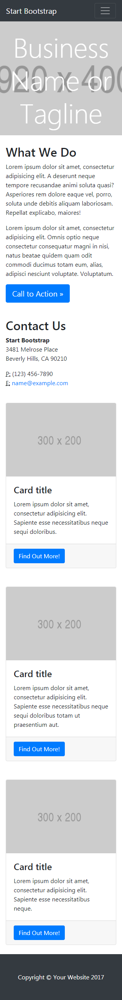
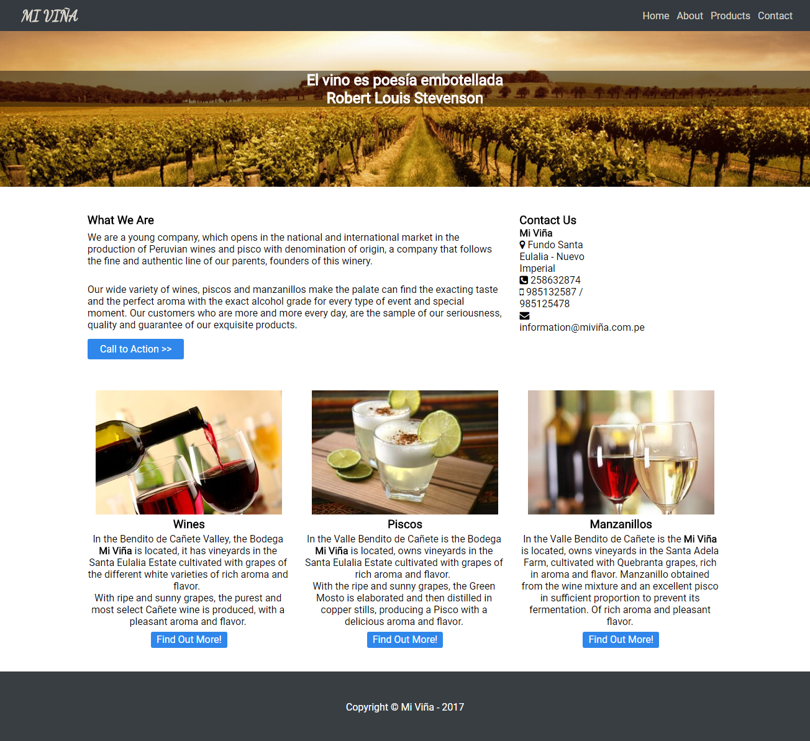

# Reto Mi Página

* **Sprint 3:**  Crea tu propia red social.  
* **Unidad 1:** La web desde un móvil.  
* **Reto 2:** Mi Página 
 
El reto consiste en crear una página web responsive tanto para desktop y mobile a gusto propio.  

Fue necesario el aprendizaje sobre **Media Queries**, **Grid Sistem**, **Viewport** y **Responsive Web Designe** para resolver este reto.

## **Condiciones** 

Se debe mantener la estructura de la página y debes realizarlo con un grid (cualquiera pero que no sea un framework como Bootstrap o Materialize). La estructura de la página es la siguiente:

**Vista Desktop**

**Vista Mobile**

## **Resultado** 

**Vista Desktop**

**Vista Mobile**

